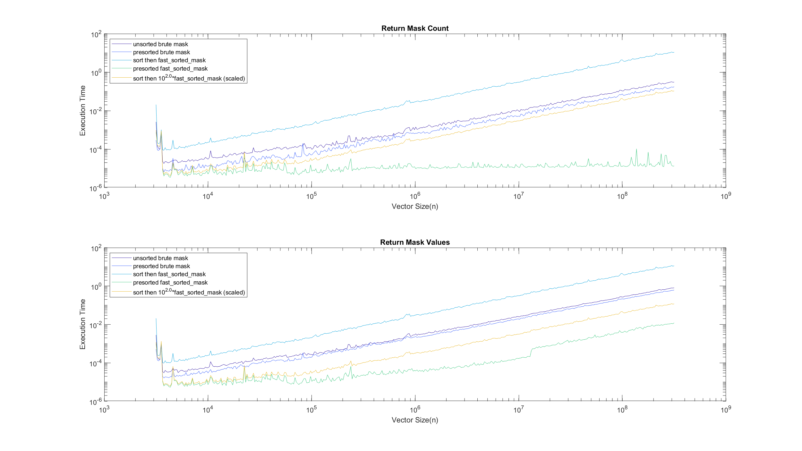
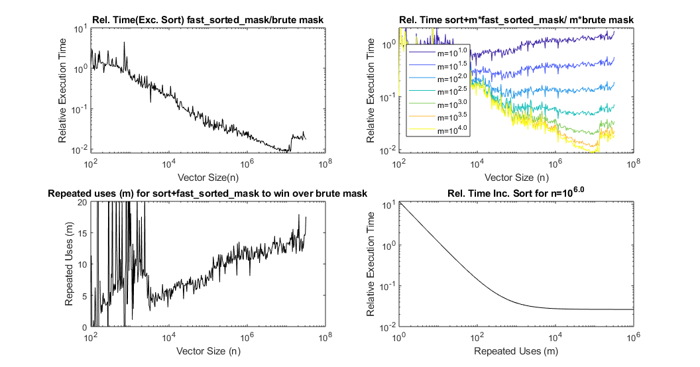

# fast_sorted_mask
matlab code for fast masking of ordered vectors based on binary search.

Selecting a subset of a vector that is between some limits (herein *masking*) is a widely used analytical tool in particle physics and the analysis routines of the He* BEC group ([@spicydonkey](https://github.com/spicydonkey/hebec_essentials),[@GroundhogState](https://github.com/GroundhogState)). The common approach of comparing each element to the upper and lower limit  (herein *Brute compare*) has complexity O\~ n . The novel contribution of this code is a demonstration of a relatively simple approach that uses binary compare (O\~log(n)) on an ordered vector to achieve superior performance in two cases. 
1. Data that is already sorted (O\~log(n) cf. brute O\~n).
2. When there is a requirement to repeatedly (m) mask the same data such that the the inial cost of the sort is offset by the increased speed of the sort operation. (O\~n·log(n)+m·log(n) cf, O\~n·m)

The code here demonstrates the algorithm in native matlab and provides a number of tests in order to compare the performance.
For taking small slices of large (>1e6 elments) sorted vectors a speedup of 100x is demonstrated.

|  | 
|:--:| 
 **Figure1**- Comparison of the brute mask to the fast_sorted_mask. The brute mask for sorted and unsorted data gives comparable performance at large n, however at intermediate n \~10^2.1 the sorted date version is slightly faster which is somewhat puzzling. The fast_sorted_mask execution time (for a presorted vector) is superior at all values of n>10^2.1, however when the sort time is induced is slower than the brute mask. If however the execution time is measured an sort and then m=1e2 masking operations (and scaled) then superior performance is obtained.  |

|  | 
|:--:| 
| **Figure2**-**Retuning Values** **(a)** (Top left)The Relative execution time of the algorithm run on sorted data (of length n) compared to a simple brute compare approach.**(b)** (Top right) The Relative execution time of sorting data and then running the algorithm m times compared to the a simple brute compare approach (that does not requires sorted data) for the same m executions.**(c)**(Bottom left) the number of repeated uses (m) that are required in order to offest the inital sort time and produce the same execution time as the brute compare. **(d)**(Bottom right) as in **(b)** with varied m and fixed n.  |

|  | 
|:--:| 
| **Figure2**-**Retuning Values** **(a)** (Top left)The Relative execution time of the algorithm run on sorted data (of length n) compared to a simple brute compare approach.**(b)** (Top right) The Relative execution time of sorting data and then running the algorithm m times compared to the a simple brute compare approach (that does not requires sorted data) for the same m executions.**(c)**(Bottom left) the number of repeated uses (m) that are required in order to offest the inital sort time and produce the same execution time as the brute compare. **(d)**(Bottom right) as in **(b)** with varied m and fixed n.  |

## Contributions
-Benjamin Bernard: Binary search modified from fileexchange project [binary-search-for-closest-value-in-an-array](https://au.mathworks.com/matlabcentral/fileexchange/37915-binary-search-for-closest-value-in-an-array)

## Future work
- figure out what the bump in the relative time is at n=10^7.05 
- Compile to C
- Fast 1d histogram based on this approach
  - Adaptive between sort-search and brute based on the number of input counts
- Fast n histogram to replace [histcn](https://au.mathworks.com/matlabcentral/fileexchange/23897-n-dimensional-histogram?focused=5198474&tab=function) & [ndhistc](https://au.mathworks.com/matlabcentral/fileexchange/3957-ndhistc)
  
