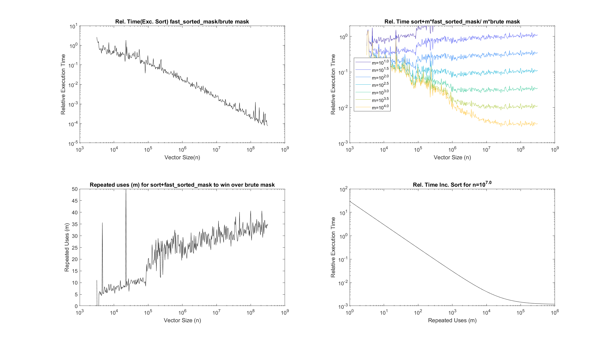
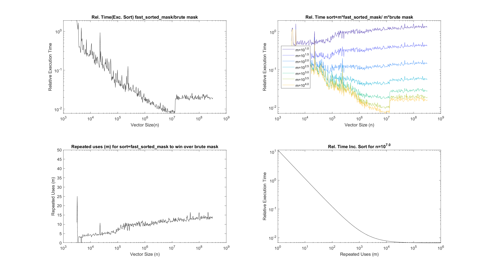

# fast_sorted_mask
**Bryce M. Henson**  
Matlab code for fast masking/selection of ordered vectors based on binary search.

Selecting a subset of a vector that is between some limits (herein *masking*,sometimes known as 'gating') is a widely used analytical tool (eg. particle physics) commonly employed in the analysis routines of the He* BEC group ([@spicydonkey](https://github.com/spicydonkey/hebec_essentials),[@GroundhogState](https://github.com/GroundhogState)). 

The common approach to creating a histogram involves comparing each element to the upper and lower limit (herein *Brute compare*) has complexity O(n). The novel contribution of this code is a demonstration of a relatively simple approach that uses a binary search algorithm ( O(log(n)) ) on an ordered vector to achieve superior performance in two use cases. 
1. Data that is already sorted ( O(log(n)) cf. brute O(n) ).
2. When there is a requirement to repeatedly (m) mask the same data such that the the inial cost of the sort is offset by the increased speed of the mask operation. (O(n·log(n)+m·log(n)) cf, O(n·m) )

There are two things that the user may want from this masking operation:
1. Returning the number of data points(or counts) in this mask (herein *retun mask count*).
   * This is where the search based algorithm really shines compared to the brute mask (as it just subtracts the uper and lower index while the brute compare must count up the logical vector, see detials).
2. Return the values of the data that maskes it through this mask. (herein *retun mask values*)
   * This has a smaller speedup because copying a subset of a vector (even a contiguous block) is a substantialy slower than the search.


The code here demonstrates the algorithm for both types (counting and subset) in native matlab and provides a number of tests in order to compare the performance.
For taking small slices of large (>1e6 elments) sorted vectors a speedup of 1000x is demonstrated.

|  | 
|:--:| 
 **Figure1**- Comparison of the brute mask to the fast_sorted_mask on an i7-7700 @ 4.00GHz . The brute mask for sorted and unsorted data gives comparable performance at large n, however at intermediate n \~10^2.1 the sorted date version is slightly faster which is somewhat puzzling. The fast_sorted_mask execution time (for a presorted vector) is superior at all values of n>10^2.1, however when the sort time is induced is slower than the brute mask. If however the execution time is measured an sort and then m=1e2 masking operations (and scaled) then superior performance is obtained.  |


|  | 
|:--:| 
| **Figure2**-**Retuning Counts** **(a)** (Top left)The Relative execution time of the algorithm run on sorted data (of length n) compared to a simple brute compare approach.**(b)** (Top right) The Relative execution time of sorting data and then running the algorithm m times compared to the a simple brute compare approach (that does not requires sorted data) for the same m executions.**(c)**(Bottom left) the number of repeated uses (m) that are required in order to offest the inital sort time and produce the same execution time as the brute compare. **(d)**(Bottom right) as in **(b)** with varied m and fixed n.  |


|  | 
|:--:| 
| **Figure2**-**Retuning Values** **(a)** (Top left)The Relative execution time of the algorithm run on sorted data (of length n) compared to a simple brute compare approach.**(b)** (Top right) The Relative execution time of sorting data and then running the algorithm m times compared to the a simple brute compare approach (that does not requires sorted data) for the same m executions.**(c)**(Bottom left) the number of repeated uses (m) that are required in order to offest the inital sort time and produce the same execution time as the brute compare. **(d)**(Bottom right) as in **(b)** with varied m and fixed n.  |

## Details
The brute compare implementation is very easy by using a logical mask vector:
```
mask=data>lower_lim & data<upper_lim 
```
(If you are not familaiar with Logical indexing [read more here](https://blogs.mathworks.com/loren/2013/02/20/logical-indexing-multiple-conditions/)  )
the number of counts (integer) may be extracted as
```
num_mask=sum(mask)
```
or the subset of data points (vector)
```
subset_mask=data(mask)
```
The equivelent (but faster) operation using fast_sorted_mask on ordered data is:
```
mask_idx=fast_sorted_mask(data,lower_lim,upper_lim);
num_mask=mask_idx(2)-mask_idx(1)+1;
subset_mask=data(mask_idx(1):mask_idx(2)); 
```
***WARNING: the data vector MUST be sorted. See figures above for when it is still advantagous to use this approach for unordered data. ***

## Contributions
- **Benjamin Bernard** Binary search modified from fileexchange project [binary-search-for-closest-value-in-an-array](https://au.mathworks.com/matlabcentral/fileexchange/37915-binary-search-for-closest-value-in-an-array)

## Future work
- check what the function does to counts that equal the bin edge
- figure out what the bump in the relative time is at n=10^7.05 
- Compile to C
  - attempts have not shown any improvement.
- Fast 1d histogram based on this approach
  - Adaptive between sort-search and brute based on the number of input counts
- Fast n histogram to replace [histcn](https://au.mathworks.com/matlabcentral/fileexchange/23897-n-dimensional-histogram?focused=5198474&tab=function) & [ndhistc](https://au.mathworks.com/matlabcentral/fileexchange/3957-ndhistc)
- add to fileexchange
  
